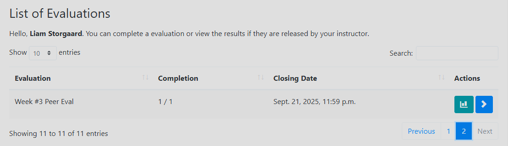
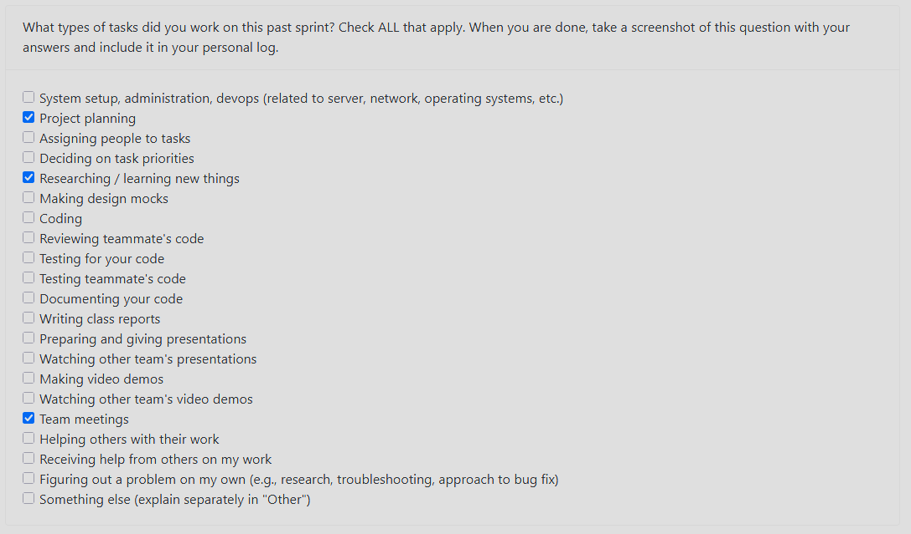
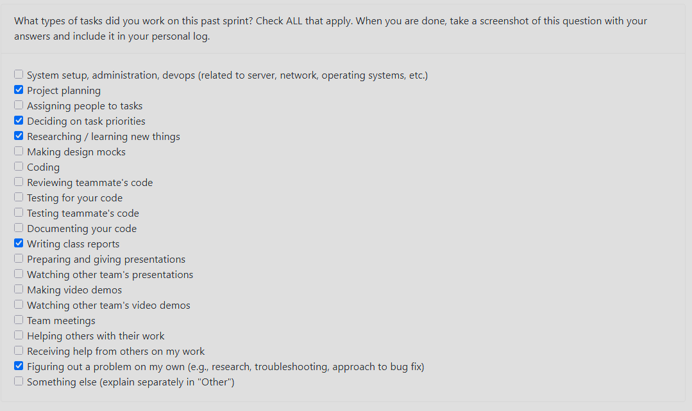

# Personal log of Liam Storgaard 

## Week 3

### What went well

- Team seems to work well together so far.
- We got some perspective on the merits of a desktop vs. web based app for the project

### What didn’t go well

- Requirements from other teams were basically identical to our own so not much was learned beyond what was stated above.

### Planning for the next cycle

- Further refine the planned structure of our app
- Decide who will be doing what on the project more concretely.
- Refine requirements as needed.

<<<<<<< HEAD

## Week 4

### What went well

- We were able to sort out both the issue with our team number and the issue with the logs/docs branch effectively and communicated well.
- Seeing other groups system design architectures gave us more ideas for our frontend/backend integration.

### What didn’t go well

- We needed more time to create a full system architecture diagram and only had a simplified one by Wednesday's class since we needed to do more research on the ML aspect of the backend.

### Planning for the next cycle

- Prepare to assign roles to people based on their skills
- Begin discussing the technical details of the ML processing (which python framework, model, etc. to use).
- Come up with a plan for which tasks to complete first when we eventually do begin programming.

=======

>>>>>>> 4cd65fab86bd9dc7758b6efef1baf171296a928d
