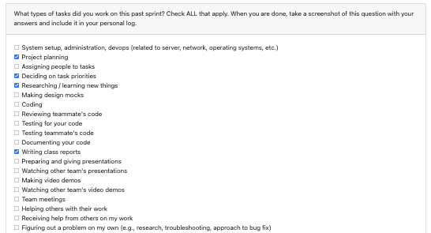

# Personal log of Will Tilden (from Week 3)

## What went well

- Team seems to work well together so far similar mindset and determination to do well on the project
- We got along well not just as like a team but we can have fun together which I think is important for a long term project like this one

## What didn’t go well

- The requirements gathering activity, while I believe I understand the intetion behind it, didn't feel terribly useful just given that a lot of the time was spent repeating requirements back at each other that teams already had themselves, I think I would have preffered having requirements given to us and just getting on writing the code sooner personally

## Planning for the next cycle

- Clarify and solidify requirements to the point that they are ready to inform coding / building decisions
- Delegate roles and responsibilities as far as who should work on which part(s) of the app
- Develop a sprint structure and cycle of some kind to keep the team synchronized and organized in moving forward with the project at the right pace and in an organized fashion

