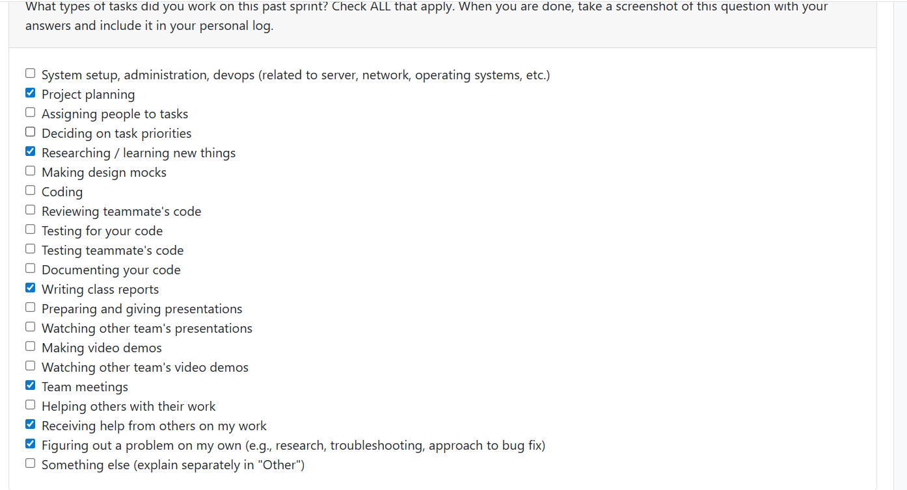
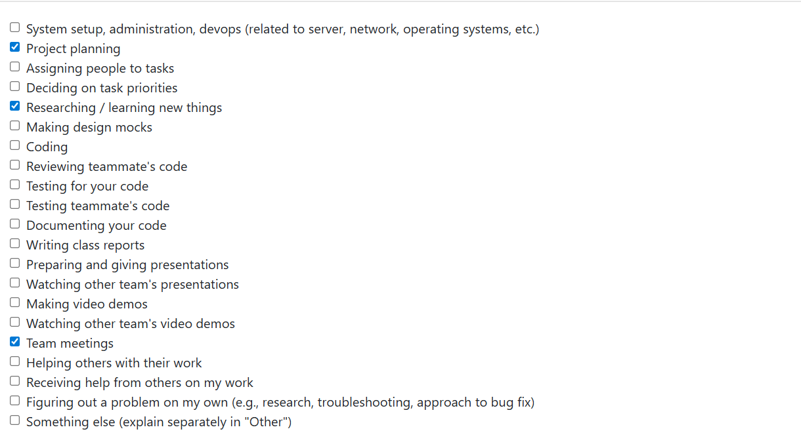

# Personal Log of Alex Batke

## Week 4

### Applicable Date Range
- Monday, September 22nd to Sunday, September 28th

### Peer evaluation screenshot

### Recap On Your Weeks Goals
- Which Features Were Yours in the Project Plan for this Milestone?
  I gave feedback and suggestions on both our project proposal and our system architecture diagram, whcih were completed this week
- Which Tasks from the Project Board are Associated with these Features?
  The relevant issues were put on the Github Project board, with all group members being assigned to both
- Among these tasks, which have you completed/in progress in the last 2 weeks?
  As previously mentioned, both the system architecture diagram and project proposal was completed, along with each member setting up their local development environment 
- Optional text: additional context that we should be aware of:
  No issues at all at this point. On to next week!

## (Week 3)

### WHat went well 

- Inital discussion between team members about general project guidelines and requirements were effective. Tean consenus was reached on multiple different points
- making small, sensible refinements to our team's list of requirements after the inter-team discussion of the project requirements 

### WHat didn't go well
- requirements from some teams were not measurable, making it difficult to understamd their thought process and what they deemed neccessary
- other requirements from some teams were also non specific (eg. the system should search the user's folder structure)

### Planning for the next cycle
- Deciding roles for team members
- Start more specific, in depth planning for the project
- fine tune requirements as necessary as planning continues

### Peer Evaluation screenshot
 