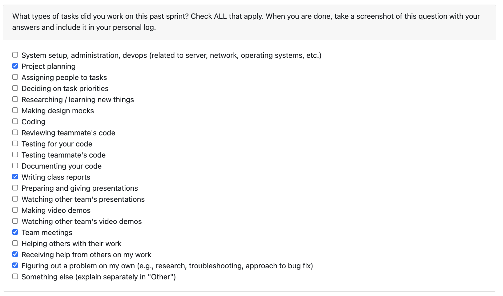
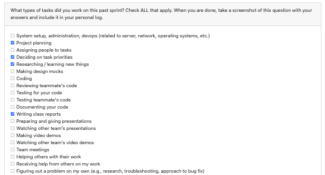

# Personal log of Will Tilden (from Week 4) as per the personal log format outlined in lecture slides

## Applicable date range
- Monday, September 22nd to Sunday, September 28th

## Type of tasks I worked on

## Recap on your weeks goals

- Which features were yours in the project plan for this milestone?

    I was working on the project proposal and the system architecture diagram along with the rest of the team which we finished well and on time.

- Which tasks from the project board are associated with these features?

    These features, the proposal and system architecture diagram, were recorded as issues in our github repository and have all team members listed on them as assignees.

- Among these tasks, which have you completed / in progress in the last 2 weeks?

    This week we completed both the project proposal and the system architecture diagram and next week we will move on to the data flow diagram.

- Optional text: additional context that we should be aware of

    Another good week with a good team! Looking forward to working with this team throughout the year.

# Personal log of Will Tilden (from Week 3)

## What went well

- Team seems to work well together so far similar mindset and determination to do well on the project
- We got along well not just as like a team but we can have fun together which I think is important for a long term project like this one

## What didn’t go well

- The requirements gathering activity, while I believe I understand the intetion behind it, didn't feel terribly useful just given that a lot of the time was spent repeating requirements back at each other that teams already had themselves, I think I would have preffered having requirements given to us and just getting on writing the code sooner personally

## Planning for the next cycle

- Clarify and solidify requirements to the point that they are ready to inform coding / building decisions
- Delegate roles and responsibilities as far as who should work on which part(s) of the app
- Develop a sprint structure and cycle of some kind to keep the team synchronized and organized in moving forward with the project at the right pace and in an organized fashion

